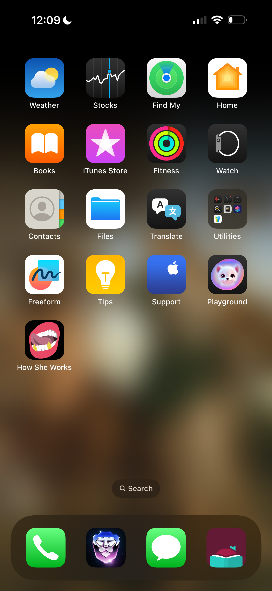
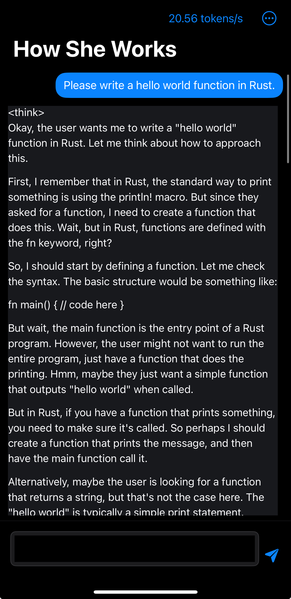
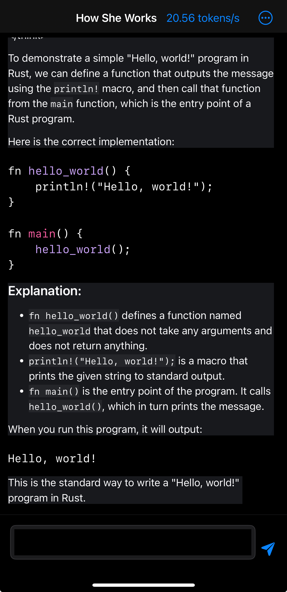

# Jade

iOS App that uses Apple MLX to run Awful Security LLM Finetunes on Apple devices.

Jade builds on top of [MLXChatExample](https://github.com/ml-explore/mlx-swift-examples/tree/main/Applications/MLXChatExample) to bring private, on-device chats to your Apple devices without the need for an internet connection (with the exception of downloading the intital model weights from Huggingface). No data leaves your device.

Jade uses [HighlightSwift](https://github.com/appstefan/HighlightSwift) to bring syntax highlighting to code blocks.